# ⚽ Akademi FK — Altyapı Futbol Akademisi Yönetim Sistemi

<p align="center">
  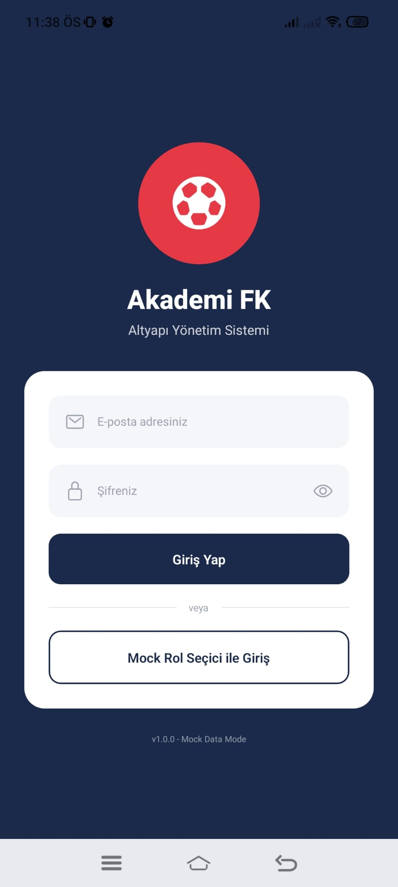
  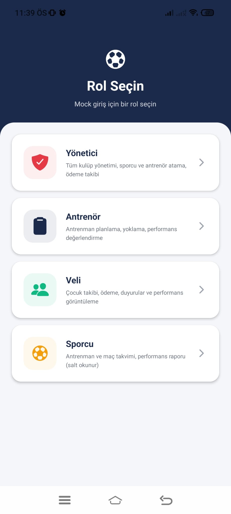
  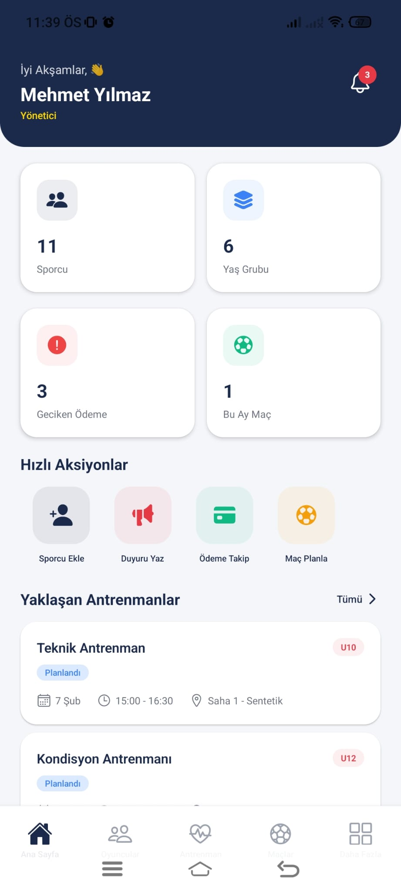
</p>

**Akademi FK**, futbol altyapı akademilerinin tüm operasyonlarını tek bir mobil uygulama üzerinden yönetmesini sağlayan kapsamlı bir React Native uygulamasıdır. Sporcu takibi, antrenman planlaması, maç yönetimi, performans değerlendirmesi, ödeme takibi ve duyuru sistemi gibi modülleri barındırır.

---

## 📋 İçindekiler

- [Özellikler](#-özellikler)
- [Ekran Görüntüleri](#-ekran-görüntüleri)
- [Kullanıcı Rolleri](#-kullanıcı-rolleri)
- [Uygulama Modülleri](#-uygulama-modülleri)
- [Teknik Altyapı](#-teknik-altyapı)
- [Kurulum](#-kurulum)
- [Proje Yapısı](#-proje-yapısı)
- [Renk Şeması](#-renk-şeması)

---

## 🚀 Özellikler

- 🔐 **Rol tabanlı kimlik doğrulama** — Admin, Antrenör, Veli ve Sporcu rolleri
- 📊 **Dinamik Dashboard** — Her role özel istatistikler ve hızlı erişim kartları
- 👥 **Sporcu & Yaş Grubu Yönetimi** — U8'den U13'e kadar detaylı kadro yönetimi
- 🏋️ **Antrenman Planlama & Yoklama** — Antrenman oluşturma, saha atama, yoklama takibi
- ⚽ **Maç Yönetimi** — Lig, kupa, turnuva ve hazırlık maçları; skor, kadro ve istatistik takibi
- 📈 **Performans Değerlendirmesi** — Teknik, fiziksel ve disiplin metrikleri (1-10 skala)
- 💰 **Ödeme Takibi** — Aidat durumu, ödeme geçmişi, gecikme bildirimleri
- 📢 **Duyuru Sistemi** — Öncelik seviyeleri ile genel ve yaş grubuna özel duyurular
- 📸 **Medya Galerisi** — Fotoğraf, video ve belge arşivi
- 🔔 **Bildirim Sistemi** — Okunmamış bildirim sayacı ve bildirim yönetimi

---

## 📱 Ekran Görüntüleri

### Kimlik Doğrulama & Ana Sayfa

| | | | |
|:---:|:---:|:---:|:---:|
|  |  |  | 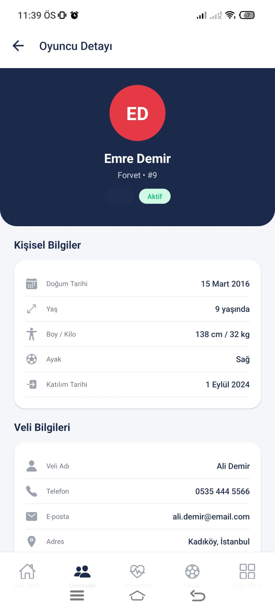 |

### Oyuncular & Antrenman

| | | | |
|:---:|:---:|:---:|:---:|
| 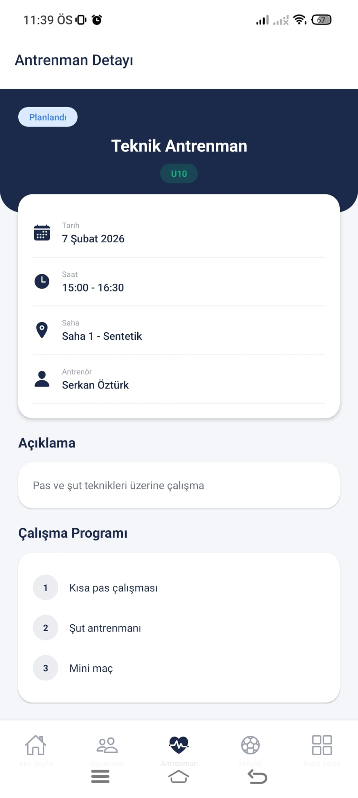 | 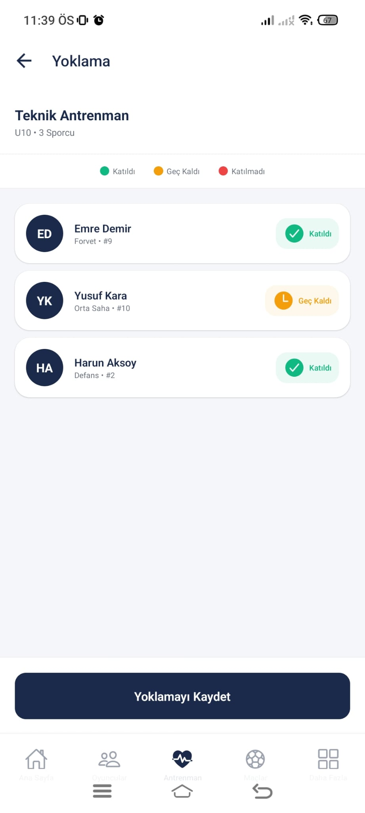 | 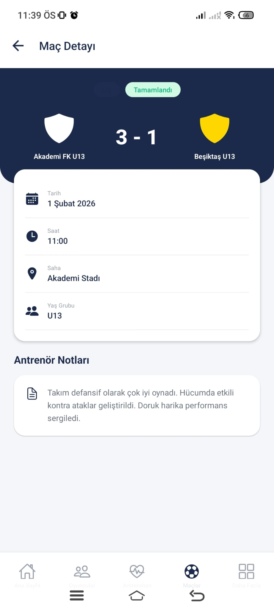 | 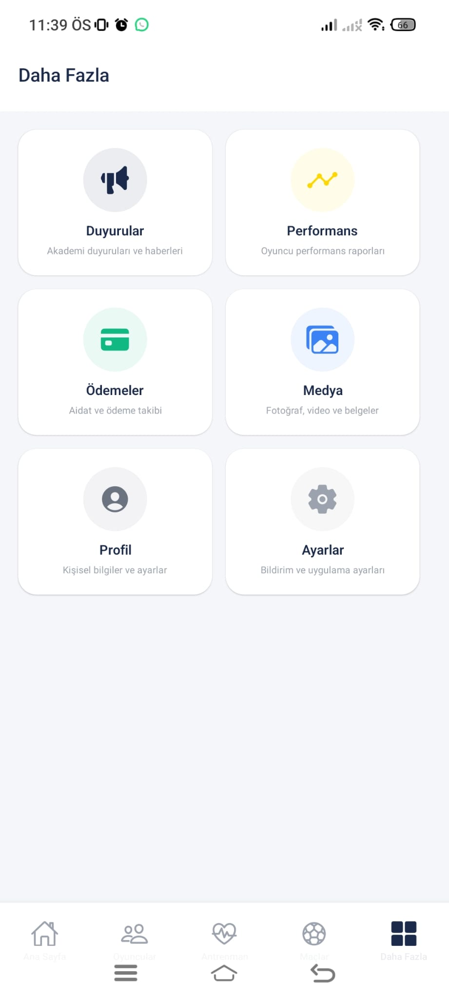 |

### Maçlar, Performans & Diğer

| | | | |
|:---:|:---:|:---:|:---:|
| 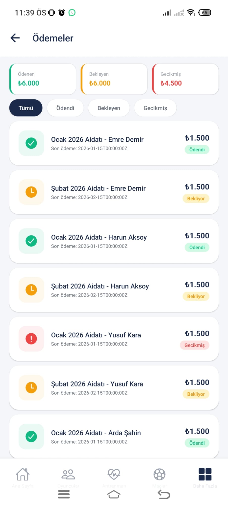 | 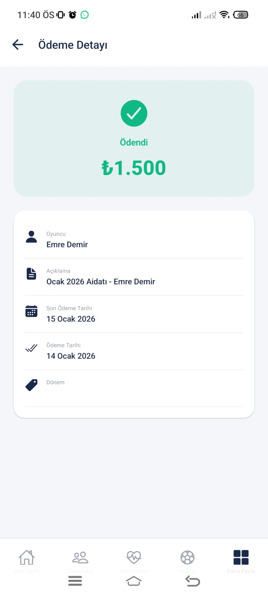 | 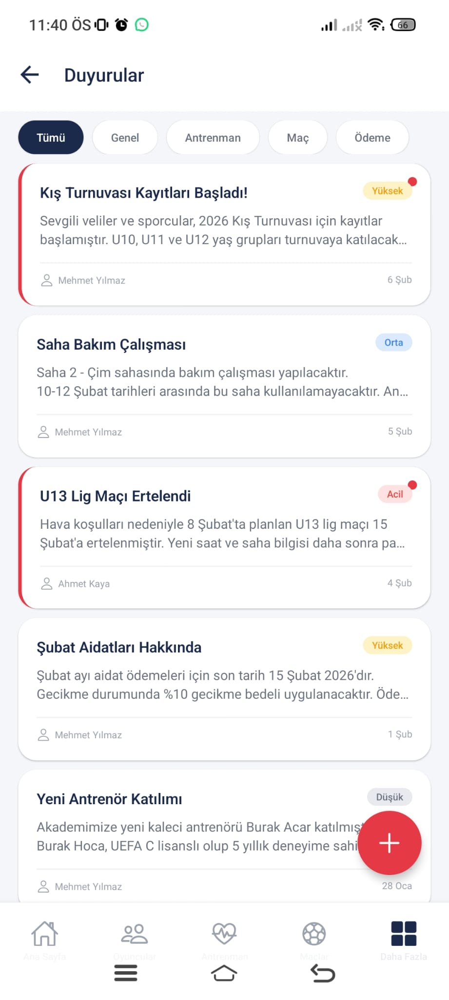 | 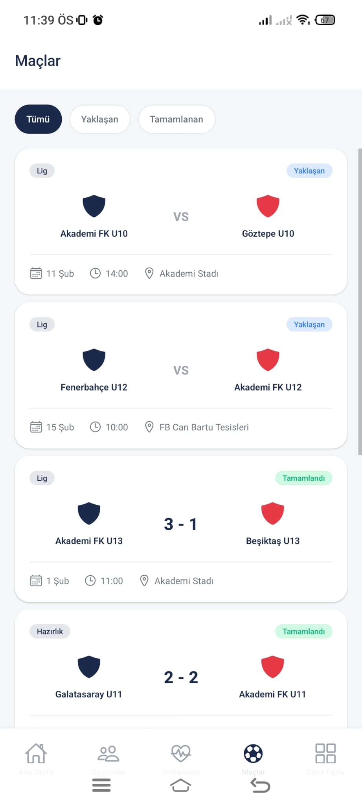 |

---

## 👤 Kullanıcı Rolleri

| Rol | Açıklama | Erişebildiği Modüller |
|-----|----------|----------------------|
| **🛡️ Admin (Yönetici)** | Kulüp yönetimi, tüm veriler üzerinde tam yetki | Tüm modüller |
| **🏅 Antrenör** | Antrenman planlaması, yoklama, performans değerlendirmesi | Oyuncular, Antrenman, Maçlar, Performans, Duyurular |
| **👨‍👩‍👧 Veli** | Çocuk takibi, ödeme durumu, duyurular | Dashboard, Ödemeler, Duyurular, Performans, Medya |
| **⚽ Sporcu** | Takvim, maç bilgileri, kişisel performans | Dashboard, Maçlar, Performans (salt okunur), Medya |

Her rol giriş yaptığında kendine özel bir dashboard ve navigasyon menüsü ile karşılaşır.

---

## 📦 Uygulama Modülleri

### 🔐 Kimlik Doğrulama
- E-posta ve şifre ile giriş
- Hızlı rol seçimi ile demo giriş
- Zustand ile oturum yönetimi

### 🏠 Dashboard (Ana Sayfa)
- Gün dilimine göre selamlama mesajı
- Rol bazlı istatistik kartları (aktif sporcu, yaş grubu, geciken ödemeler, yaklaşan maçlar)
- Veli için ödeme uyarı banner'ı
- Yatay kaydırmalı hızlı erişim kartları
- Yaklaşan antrenmanlar, maçlar ve son duyurular bölümleri

### 👥 Sporcu Yönetimi
- **Oyuncu Listesi** — Tüm sporcuların kartları, arama ve filtreleme
- **Oyuncu Detay** — Ad, doğum tarihi, pozisyon (Kaleci / Defans / Orta Saha / Forvet), forma numarası, fiziksel özellikler, baskın ayak, yaş grupları
- **Yaş Grupları** — U8'den U13'e renk kodlu gruplar
- **Yaş Grubu Detay** — Gruba ait antrenörler ve sporcular

### 🏋️ Antrenman & Yoklama
- **Antrenman Listesi** — Planlanmış, tamamlanmış ve iptal edilmiş antrenmanlar
- **Antrenman Detay** — Tarih, saat, saha, yaş grubu, antrenör, çalışma detayları
- **Yoklama Ekranı** — Her antrenman için geldi / geç kaldı / gelmedi durumu, not ekleme

### ⚽ Maç Yönetimi
- **Maç Listesi** — Durum filtresi (yaklaşan / canlı / tamamlanmış / iptal) ve tür filtresi (lig / hazırlık / turnuva / kupa)
- **Maç Detay** — Ev sahibi & deplasman takımları, skor, saha, kadro, antrenör notları

### 📈 Performans Değerlendirmesi
- **Performans Listesi** — Tüm sporcuların genel performans skoru özeti
- **Performans Detay** — Üç kategori:
  - 🎯 **Teknik:** Pas kalitesi, şut tekniği, top kontrolü, dribling, kafa vuruşu
  - 💪 **Fiziksel:** Hız, dayanıklılık, güç, çeviklik
  - 📋 **Disiplin:** Devam durumu, takım uyumu, antrenman disiplini
- Görsel ilerleme çubukları ve genel skor dairesi
- Antrenör yorumları ve öneriler

### 💰 Ödeme Takibi
- **Ödeme Listesi** — Ödendi / beklemede / gecikmiş durumları
- **Ödeme Detay** — Tutar, açıklama, son ödeme tarihi, ödeme geçmişi

### 📢 Duyurular
- **Duyuru Listesi** — Öncelik seviyeleri (düşük / orta / yüksek / acil)
- **Duyuru Detay** — İçerik, yazar, tarih, okunma durumu, hedef yaş grupları

### 📸 Medya Galerisi
- **Medya Ekranı** — Fotoğraf, video ve belge koleksiyonu
- **Medya Detay** — Dosya bilgileri, yükleme tarihi, yaş grubu etiketleri

### 👤 Profil & Ayarlar
- **Profil** — Kişisel bilgiler ve düzenleme
- **Ayarlar** — Bildirim tercihleri ve uygulama ayarları

---

## 🛠 Teknik Altyapı

| Teknoloji | Sürüm | Kullanım |
|-----------|-------|----------|
| **React Native** | 0.81.5 | Mobil uygulama çatısı |
| **Expo** | 54.0 | Geliştirme araçları ve build sistemi |
| **TypeScript** | 5.9 | Tip güvenli geliştirme |
| **React Navigation** | 7.x | Navigasyon (Stack + Bottom Tabs) |
| **Zustand** | 5.x | Hafif state yönetimi |
| **Expo Vector Icons** | 15.x | İkon kütüphanesi (Ionicons) |
| **React Native Reanimated** | 4.x | Animasyonlar |
| **React Native Safe Area** | 5.x | Güvenli alan yönetimi |

### Mimari Yaklaşım

```
📁 src/
├── components/          # Atomic Design (Atoms + Molecules)
│   ├── atoms/           # Avatar, Badge, Button, EmptyState, LoadingIndicator
│   └── molecules/       # StatCard, MatchCard, TrainingCard, PlayerCard...
├── constants/           # Tema, renkler, spacing
├── mocks/               # Mock veri katmanı (Firebase'e geçişe hazır)
├── navigation/          # Stack ve Tab navigatörleri
├── screens/             # 20+ ekran (modül bazlı klasörleme)
├── services/            # Servis katmanı (API entegrasyonuna hazır)
├── store/               # Zustand store'ları (auth, notification)
├── types/               # TypeScript tip tanımları
└── utils/               # Yardımcı fonksiyonlar
```

### Bileşen Mimarisi (Atomic Design)

- **Atoms:** `Avatar`, `Badge`, `Button`, `EmptyState`, `ErrorState`, `LoadingIndicator`
- **Molecules:** `StatCard`, `QuickActionCard`, `SectionHeader`, `TrainingCard`, `MatchCard`, `AnnouncementCard`, `PlayerCard`, `PaymentCard`, `ProgressBar`

---

## ⚙️ Kurulum

### Gereksinimler

- Node.js 18+
- Yarn veya npm
- Expo CLI
- Android Studio (Android için) veya Xcode (iOS için)

### Adımlar

```bash
# 1. Repoyu klonlayın
git clone https://github.com/muhtalipdede/football-academy.git
cd football-academy

# 2. Bağımlılıkları yükleyin
npm install

# 3. Development sunucusunu başlatın
npx expo start

# 4. Android cihazda çalıştırın
npx expo run:android

# 5. iOS simülatörde çalıştırın (macOS)
npx expo run:ios
```

---

## 📁 Proje Yapısı

```
football-academy/
├── App.tsx                  # Root bileşen
├── index.ts                 # Entry point
├── app.json                 # Expo yapılandırması
├── package.json             # Bağımlılıklar
├── tsconfig.json            # TypeScript yapılandırması
├── assets/                  # İkonlar ve splash screen
├── screenshots/             # Ekran görüntüleri
├── android/                 # Android native dosyaları
└── src/
    ├── components/
    │   ├── atoms/           # Temel UI bileşenleri
    │   └── molecules/       # Birleşik UI bileşenleri
    ├── constants/
    │   └── theme.ts         # Renk, font, spacing tanımları
    ├── mocks/               # Mock veriler (12 dosya)
    ├── navigation/          # Navigasyon yapılandırması
    │   ├── AppNavigator.tsx
    │   ├── AuthStack.tsx
    │   ├── MainTabs.tsx
    │   ├── PlayersStack.tsx
    │   ├── TrainingStack.tsx
    │   ├── MatchesStack.tsx
    │   └── MoreStack.tsx
    ├── screens/             # Ekranlar (10 modül, 20+ ekran)
    │   ├── auth/
    │   ├── dashboard/
    │   ├── players/
    │   ├── training/
    │   ├── matches/
    │   ├── performance/
    │   ├── payments/
    │   ├── announcements/
    │   ├── media/
    │   ├── profile/
    │   └── more/
    ├── services/            # API servis katmanı
    ├── store/               # Zustand state yönetimi
    ├── types/               # TypeScript tipleri
    └── utils/               # Yardımcı fonksiyonlar
```

---

## 🎨 Renk Şeması

| Renk | Hex | Kullanım |
|------|-----|----------|
| 🔵 **Primary** | `#1B2A4A` | Ana renk — başlıklar, birincil aksiyonlar |
| 🔴 **Secondary** | `#E63946` | Vurgu rengi — CTA butonları, bildirim rozeti |
| 🟡 **Accent** | `#FFD700` | Altın — öne çıkan içerikler |
| 🟢 **Success** | `#10B981` | Yeşil — ödendi, geldi, olumlu metrikler |
| 🟠 **Warning** | `#F59E0B` | Amber — beklemede, geç kaldı |
| 🔴 **Error** | `#EF4444` | Kırmızı — gecikmiş, gelmedi, hatalar |
| 🔵 **Info** | `#3B82F6` | Mavi — bilgilendirme |
| ⬜ **Background** | `#F5F6FA` | Açık gri — uygulama arka planı |

---

## 📄 Lisans

Bu proje özel kullanım amaçlıdır.

---

<p align="center">
  <b>Akademi FK</b> ile altyapı futbol akademinizi profesyonelce yönetin ⚽
</p>
